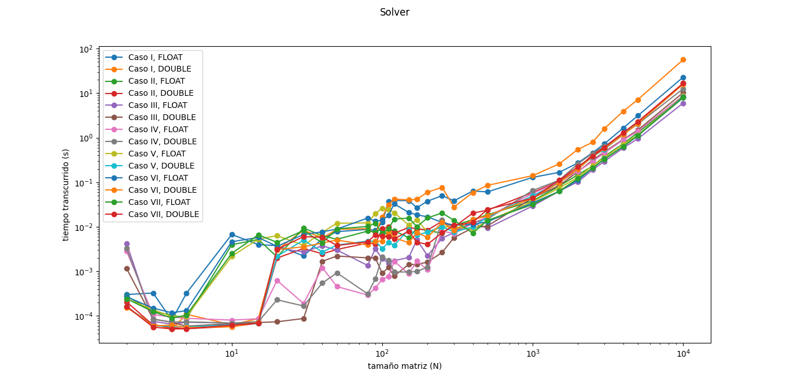
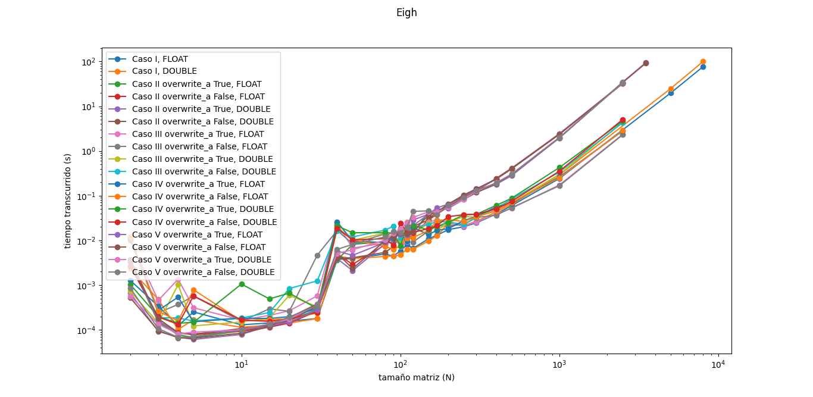

# MCOC2021-P0

# Parte P03 : Desempeño INV

Nombre: Javier Ramirez

##   Comentarios:

* Para los caso de eigh, se tuvo que bajar el tamaño de la matriz de 10000 a 2500 debido a lo costoso que es este procedimiento. En los casos de solve, se pudo usar el tamaño de matriz 10000 sin problemas.
* En los casos de solve, el que funciona mejor en relación con el tiempo transcurrido en matrices mas grandes es usado solve con assume_a="pos" con el tipo de dato float, y el que más costó hacer fue el de resolver la inversa de A por b con tipo double. Y en los casos de eigh, el método más rápido fue el caso donde se usa como parámetros driver="evd" y overwrite_a=False, con tipo de dato float; mientras el más lento fue el caso donde se usaron los parametros driver="ev" junto con overwrite_a=False, con tipo de dato double. Los casos de driver="evx" con tipo de dato double también fueron bastante lentos.
* sobre el tamaño de las matrices, en el caso de Eigh cada método mostró un comportamiento casi igual, lo unico que varía en cada método seria su velocidad de operación. Por ejemplo, en los gráficos muestran siempre el mismo peak donde N se encuentra entre 40 y 50 aprox.. En cambio, en solver dependen más del tamaño de la matriz entre N=2 y N=1000, donde es difícil determinar que método es mas rápido, pero luego con N>1000 se ve mayor uniformidad con los tiempos y se puede determinar cual metodo es mas rápido.
* La superioridad de cada opción puede deberse a prosesos que se simplifican a costa de disminuir presición al resultado. Así que lo mas probable es que los mas lentos muestren luego un resultado mas preciso que los más rápidos. Lo otro además son los tipos de datos que se usan, ya que como los tipos float son la mitad mas ligeros que los double es lógico que los float sean más rapidos para procesar que los double.
* Otro caso que ocurrió durante las corridas con eigh es que sólo trabajaba un CPU mientras los demas no.
* El uso de memoria como en las entregas anteriores, cada vez que terminaba de correr un N y pasaba a otro más grande aumentaba un poco el uso de memoria, subiendo así de forma escalonada.

##    Gráficos:

