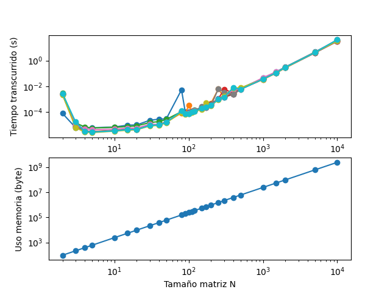
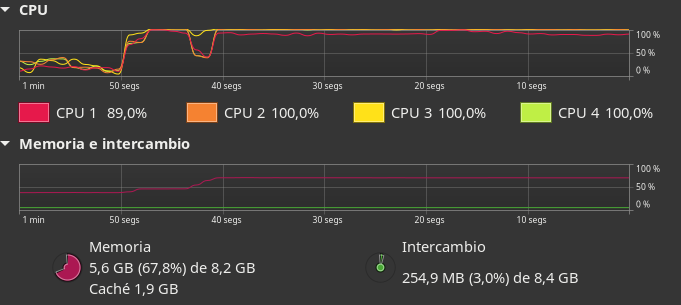
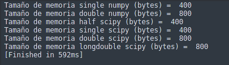
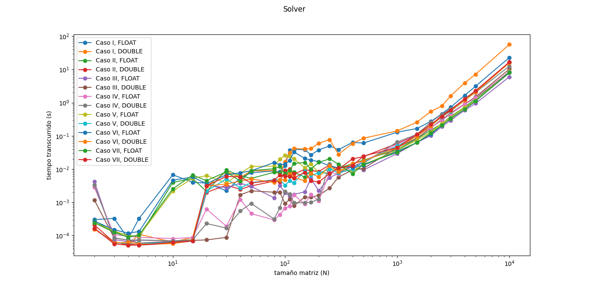
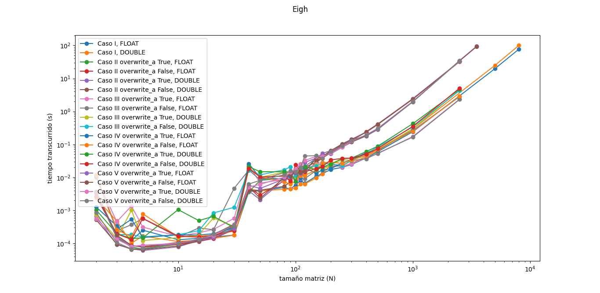
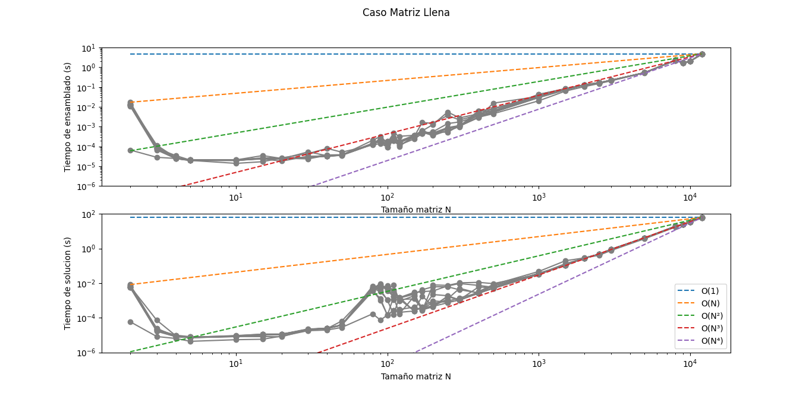
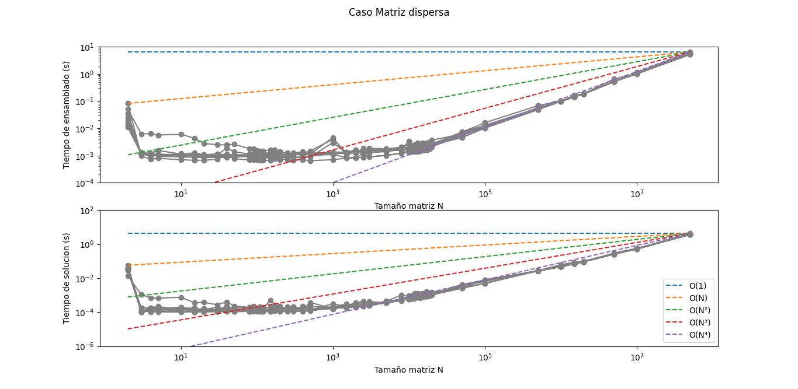

# MCOC2021-P0

# Mi computador principal

* Marca/modelo: ASUS X541UV
* Tipo: Notebook
* Año adquisición: 2019
* Procesador:
  * Marca/Modelo: Intel Core i7-6500U
  * Velocidad Base: 2.50 GHz
  * Velocidad Máxima: 3.10 GHz
  * Numero de núcleos: 2 
  * Humero de hilos: 4
  * Arquitectura: x86_64
  * Set de instrucciones: Intel SSE4.1, Intel SSE4.2, Intel AVX2
* Tamaño de las cachés del procesador
  * L1d: 32KB
  * L1i: 32KB
  * L2: 256KB
  * L3: 4096KB
* Memoria 
  * Total: 8 GB
  * Tipo memoria: DDR4
  * Velocidad: 2133 MHz
  * Numero de (SO)DIMM: 4
* Tarjeta Gráfica 1
  * Marca / Modelo: Intel HD Graphics 520
  * Memoria dedicada: 128 MB
  * Resolución: 1366 x 768
* Tarjeta Gráfica 2
  * Marca / Modelo: Nvidia GeForce 920MX
  * Memoria dedicada: 2010 MB
  * Resolución: 1366 x 768
* Disco 1: 
  * Marca: Toshiba
  * Tipo: HDD
  * Tamaño: 1TB
  * Particiones: 6
  * Sistema de archivos: EXT4, swap, NTFS, FAT32

  
* Dirección MAC de la tarjeta wifi: b0:c0:90:bd:78:97
* Dirección IP (Interna, del router): 192.168.0.11
* Dirección IP (Externa, del ISP): 190.46.130.106
* Proveedor internet: VTR Banda Ancha S.A.


# Parte P02


## Desempeño MATMUL



## Respuestas:

* Los gráficos de mi equipo se muestran mas consistentes comparado con los del profesor/ayudante.
* La diferencias en cada corrida podría ser por una sobrecarga del cpu, y por lo tanto el aumento de la temperatura hace que se ralentize un poco y no se sobrecaliente (cada corrida podría haber tenido distinta temperatura).
* No se ve un comportamiento lineal pues, como se ve en el gráfico, mientras el CPU tenga capacidad, puede trabajar siempre a la misma velocidad. Así que una vez que tiene que trabajar mas de su capacidad ahí se empieza a ralentizar, pues se genera "cuello de botella" al tener mas datos de lo que la cpu pueda procesar.
* Python 3.9.6
* Numpy 1.21.1
* Se utilizan todos los procesadores (4):



# Parte P03 : Desempeño INV

##   Comentarios:

* El procesador de mi PC solamente soporta single y double, por lo que se consideró poner de resultado únicamente esos dos tipos.

 

##    Respuestas:

* En el caso de numpy, resuelve la inversa mediante la ecuación A * x = I, usando un algoritmo basado en LAPACK (Linear Algebra Package). En Scipy hace lo mismo que en numpy, pero mas eficiente al contener mas funcionalidades como descomposicion LU, la descomposicion de Schur, y otras mejoras.
* En el caso de las operaciones singles en todo los casos mostraban mayor velocidad y actividad constante al máximo en todos los CPUs. En los casos de double son procesos mas lentos debido al mayor uso de memoria, en todos los casos el mismo comportamiento ondulatorio.


# Parte P04 : Desempeño SOLVE y EIGH

##   Comentarios:

* Para los caso de eigh, se tuvo que bajar el tamaño de la matriz de 10000 a 2500 debido a lo costoso que es este procedimiento. En los casos de solve, se pudo usar el tamaño de matriz 10000 sin problemas.
* En los casos de solve, el que funciona mejor en relación con el tiempo transcurrido en matrices mas grandes es usado solve con assume_a="pos" con el tipo de dato float, y el que más costó hacer fue el de resolver la inversa de A por b con tipo double. Y en los casos de eigh, el método más rápido fue el caso donde se usa como parámetros driver="evd" y overwrite_a=False, con tipo de dato float; mientras el más lento fue el caso donde se usaron los parametros driver="ev" junto con overwrite_a=False, con tipo de dato double. Los casos de driver="evx" con tipo de dato double también fueron bastante lentos.
* sobre el tamaño de las matrices, en el caso de Eigh cada método mostró un comportamiento casi igual, lo unico que varía en cada método seria su velocidad de operación. Por ejemplo, en los gráficos muestran siempre el mismo peak donde N se encuentra entre 40 y 50 aprox.. En cambio, en solver dependen más del tamaño de la matriz entre N=2 y N=1000, donde es difícil determinar que método es mas rápido, pero luego con N>1000 se ve mayor uniformidad con los tiempos y se puede determinar cual metodo es mas rápido.
* La superioridad de cada opción puede deberse a prosesos que se simplifican a costa de disminuir presición al resultado. Así que lo mas probable es que los mas lentos muestren luego un resultado mas preciso que los más rápidos. Lo otro además son los tipos de datos que se usan, ya que como los tipos float son la mitad mas ligeros que los double es lógico que los float sean más rapidos para procesar que los double.
* Otro caso que ocurrió durante las corridas con eigh es que sólo trabajaba un CPU mientras los demas no.
* El uso de memoria como en las entregas anteriores, cada vez que terminaba de correr un N y pasaba a otro más grande aumentaba un poco el uso de memoria, subiendo así de forma escalonada.

##    Gráficos:





# Parte P05 : Matrices dispersas y complejidad computacional

## Codigo Matriz Laplaciana

### Matriz llena:

```
def matriz_laplaciana(N, t=double):
  e =  eye(N, dtype=t)-eye(N,N,1, dtype=t)
  return e+e.T
```

### Matriz dispersa:

```
def matriz_laplaciana_sparse(N, t=double):
  return sparse.eye(N, format="csr", dtype=t)*2 - sparse.eye(N, k=1, format="csr", dtype=t) - sparse.eye(N, k=-1, format="csr", dtype=t)
```

# Gráficos:



